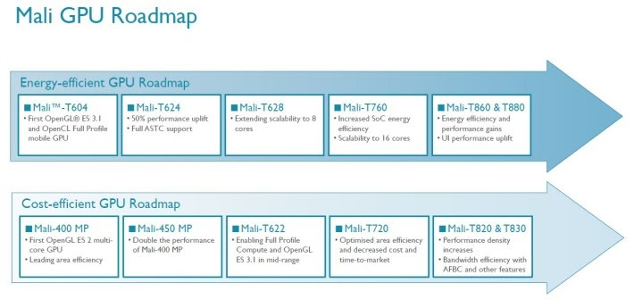
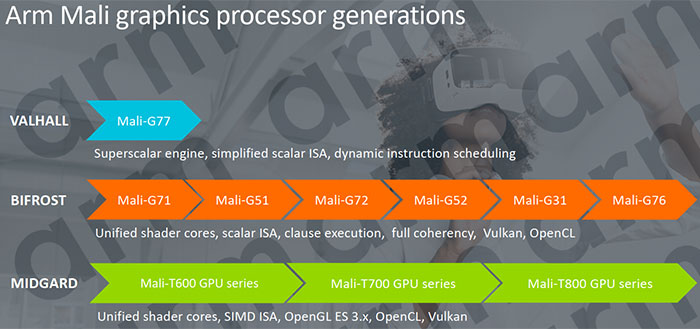
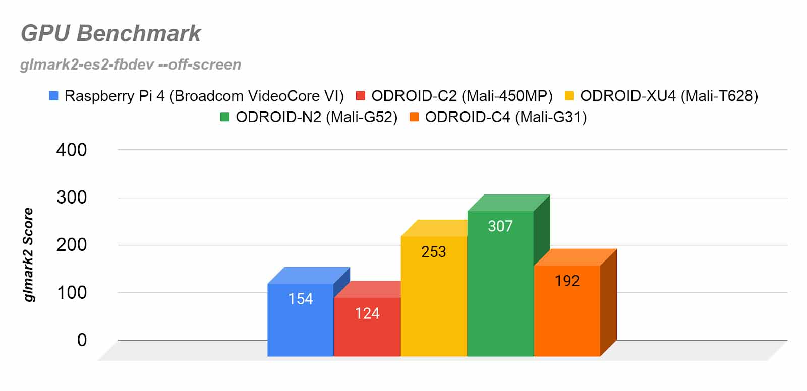

[TOC]

## Why this page
Arm's Mali GPUs have rich docs and code, making them fun to hack/mod. This page documents what we learnt about Mali during our research. Hopefully it will help others. 

Many contents are from Arm's official documents and blogs. We do our best to attribute their origins. 

## Mali generations & devices

Mali-400 (Allwinner A20/A64 boards)
Mali-450 (Utgard; HiKey)
Mali-T6x0 (Midgard; Juno, Firefly, Chromebook, Odroid XU3; Odroid XU4)
Mali-T7x0 (Midgard; Firefly, Tinkerboard, Chromebook)
Mali-T8x0 (Midgard; Firefly 2, Chromebook)
Mali-G71 (Bifrost Gen1; Hikey960)
Mali-G31 (Bifrost Gen1; Odroid HC4; Odroid C4)
Mali-G52 (Bifrost Gen2; Odroid N2)

*"MPx" -- there are X GPU cores*

The roadmaps from Arm

|                                          |      |
| ---------------------------------------- | ---- |
|  |      |

## COTS boards for Mali hacking

### Odroid C4
ODROID-HC4 (same CPU)
Mali G31 (Bifrost Gen1)

### Odroid N2
Mali G52 6EE?? (Bifrost Gen2)

### Odroid XU4
http://www.hardkernel.com/main/products/prdt_info.php?g_code=G143452239825&tab_idx=1
Mali T628 MP6  (OpenGL ES 3.0/2.0/1.1 and OpenCL 1.1 Full profile
seems to have pretty good Linux desktop support
http://ameridroid.com/t/xu4

(credits: Odroid)

### Hikey970

ARM Mali-G72 MP12 GPU. MP12 -- 12 cores
[Dec 2020] out of stock everywhere… . does not look promising

### Hikey960 
SoC:  Kirin 960
[Mar 2020] Seems out of stock everywhere. Bad. 

Mali G71 MP8, Bifrost arch. MP8 -- 8 cores
https://developer.arm.com/ip-products/graphics-and-multimedia/mali-gpus/mali-g71-gpu
To build kernel driver
https://community.arm.com/developer/tools-software/graphics/f/discussions/10863/how-to-build-bifrost-mali-g71-kernel-driver-on-hikey960-96boards
Kernel tree 4.19.5 (seems for AOSP)
https://git.linaro.org/people/manivannan.sadhasivam/hikey.git

### Hikey 
T450mp4. (Utgard) kernel support for mali integrated for AOSP (but not for debian -- probably not a primary goal of linaro) 
most recent debian kernel does NOT integrate mali driver (devices/gpu/mali)
https://github.com/Linaro/documentation/blob/master/Reference-Platform/Releases/RPB_16.06/ConsumerEdition/HiKey/BFSDebianRPB.md

Android’s support for GPU is pretty good
https://source.android.com/source/devices#620hikey

## Mali ISAs & internals

* good blog series. esp on Bifrost internals
https://community.arm.com/developer/tools-software/graphics/b/blog/posts/the-mali-gpu-an-abstract-machine-part-4---the-bifrost-shader-core

* The lima wiki provides lots of good info about Mali (may be outdated)
http://limadriver.org/T6xx+ISA/

Mali hardware (including 400)
https://limadriver.org/Hardware/

Lima driver arch (reverse enginerring, hw/sw interaction ... can be useful)
https://people.freedesktop.org/~libv/FOSDEM2012_lima.pdf

* T880 internals (good -- the GPU was used in mediatek x20)
https://www.hotchips.org/wp-content/uploads/hc_archives/hc27/HC27.25-Tuesday-Epub/HC27.25.50-GPU-Epub/HC27.25.531-Mali-T880-Bratt-ARM-2015_08_23.pdf

* G71, Bifrost. Good
https://www.hotchips.org/wp-content/uploads/hc_archives/hc28/HC28.22-Monday-Epub/HC28.22.10-GPU-HPC-Epub/HC28.22.110-Bifrost-JemDavies-ARM-v04-9.pdf

* “ARM Mali GPU Midgard Architecture”. Good slides on Midgard (2016. good)
http://fileadmin.cs.lth.se/cs/Education/EDAN35/guestLectures/ARM-Mali.pdf
https://www.hotchips.org/wp-content/uploads/hc_archives/hc28/HC28.22-Monday-Epub/HC28.22.10-GPU-HPC-Epub/HC28.22.110-Bifrost-JemDavies-ARM-v04-9.pdf

* Mali’s shader core: unified, for vertex/fragment/compute, varying 1--16. 
shared L2: 32--64KB
http://www.anandtech.com/show/8234/arms-mali-midgard-architecture-explored/7

* Midgard GPU arch (overview)
http://malideveloper.arm.com/downloads/ARM_Game_Developer_Days/PDFs/2-Mali-GPU-architecture-overview-and-tile-local-storage.pdf

* ARM mali officially supported boards (old?)
https://developer.arm.com/products/software/mali-drivers/user-space
inc.  T760MP4
http://en.t-firefly.com/en/firenow/firefly_rk3288/

* Linux’s support for Mali
https://wiki.debian.org/MaliGraphics

Blogs on Mali driver internals (in Chinese, verbose. somewhat useful)
https://jizhuoran.gitbook.io/mali-gpu/mali-gpu-driver/she-bei-zhu-ce-gpu-register

PAtrace -- useful tools for Mali GLES record & replay
https://github.com/ARM-software/patrace