# Notes on tinkering with Arm Mali GPUs


See Heejin's pages for much richer information:

https://bakhi.github.io/mobileGPU/


Our papers:

* Safe and Practical GPU Computation in TrustZone, Heejin Park and Felix Xiaozhu Lin, in Proc. EuroSys, May. 2023
  
* GPUReplay: A 50-KB GPU Stack for Client ML, Heejin Park and Felix Xiaozhu Lin, in Proc. ASPLOS, Mar. 2022 


## Why this page

Arm's Mali GPUs have rich docs and code, making them fun to hack/mod. This page documents what we learnt about Mali during our research. Hopefully it will help others. 

Disclaimer: Many contents are from Arm's official documents and blogs. We do our best to attribute their origins. Much info is based on our own guess work & code reading. 

* [Why this page](#why-this-page)
* [Mali generations](#mali-generations)
* [COTS boards](#cots-boards)
* [Hardware internals](#hardware-internals)
* [Resources](#resources)
  * [Projects](#projects)
  * [Articles](#articles)
* [the kernel driver](#the-kernel-driver)
  * [Acronyms](#acronyms)
  * [Overview](#overview)
  * [The register interface](#the-register-interface)
  * [Job slots](#job-slots)
  * [Memory management](#memory-management)
  * [Tracing](#tracing)
  * [GPU virtual memory](#gpu-virtual-memory)

(see toc.sh) 


# Mali generations

Mali-400 (Allwinner A20/A64 boards)
Mali-450 (Utgard; HiKey)
Mali-T6x0 (Midgard; Juno, Firefly, Chromebook, Odroid XU3; Odroid XU4)
Mali-T7x0 (Midgard; Firefly, Tinkerboard, Chromebook)
Mali-T8x0 (Midgard; Firefly 2, Chromebook)
Mali-G71 (Bifrost Gen1; Hikey960)
Mali-G31 (Bifrost Gen1; Odroid HC4; Odroid C4)
Mali-G52 (Bifrost Gen2; Odroid N2)

*"MPx" -- there are X GPU cores*

The roadmaps from Arm

|                                          |      |
| ---------------------------------------- | ---- |
|  |      |

# COTS boards 

### Odroid C4
ODROID-HC4 (same CPU)
Mali G31 (Bifrost Gen1)

### Odroid N2
Mali G52 6EE?? (Bifrost Gen2)

### Odroid XU4
http://www.hardkernel.com/main/products/prdt_info.php?g_code=G143452239825&tab_idx=1
Mali T628 MP6  (OpenGL ES 3.0/2.0/1.1 and OpenCL 1.1 Full profile
seems to have pretty good Linux desktop support
http://ameridroid.com/t/xu4


(credits: Odroid)

### Hikey970

ARM Mali-G72 MP12 GPU. MP12 -- 12 cores
[Dec 2020] out of stock everywhere… . does not look promising

### Hikey960 
SoC:  Kirin 960
[Mar 2020] Seems out of stock everywhere. Bad. 

Mali G71 MP8, Bifrost arch. MP8 -- 8 cores
https://developer.arm.com/ip-products/graphics-and-multimedia/mali-gpus/mali-g71-gpu
To build kernel driver
https://community.arm.com/developer/tools-software/graphics/f/discussions/10863/how-to-build-bifrost-mali-g71-kernel-driver-on-hikey960-96boards
Kernel tree 4.19.5 (seems for AOSP)
https://git.linaro.org/people/manivannan.sadhasivam/hikey.git

### Hikey 
T450mp4. (Utgard) kernel support for mali integrated for AOSP (but not for debian -- probably not a primary goal of linaro) 
most recent debian kernel does NOT integrate mali driver (devices/gpu/mali)
https://github.com/Linaro/documentation/blob/master/Reference-Platform/Releases/RPB_16.06/ConsumerEdition/HiKey/BFSDebianRPB.md

Android’s support for GPU is pretty good
https://source.android.com/source/devices#620hikey

# Hardware internals

The building block is a "quad". A quad execution engine -- Arm's fundamental building block

G71: 4-wide SIMD per quad;  3x quads per core. 12 FMAs at the same time. These 3 quads are managed by a core's quad manager.

G76: 8-wide SIMD per quad, 3 quads per core. 

Used to be a "narrow wavefront" (before G76)

Midgard: VLIW -- extracting 4-way ILP from each thread. 
Bifrost -- SIMD grouping 4 threads together 


[Anandtech's writeup](https://www.anandtech.com/show/12834/arm-announces-the-mali-g76-scaling-up-bifrost/2) is particularly useful:

**In both the Mali-G71 and G72, a quad is just that: a 4-wide SIMD unit, with each lane possessing separate FMA and ADD/SF pipes**. Fittingly, the width of a wavefront at the ISA-level for these parts has also been just 4 instructions, meaning all of the threads within a wavefront are issued in a single cycle. **Overall, Bifrost’s use of a 4-wide design was a notably narrow choice relative to most other graphics architectures.**

This is a very interesting change because, simply put, **the size of a wavefront is typically a defining feature of an architecture.** For long-lived architectures, especially in the PC space, wavefront sizes haven’t changed for years. 

### Bifrost
Arm's slides:

|                                          |                                      |                              |
| ---------------------------------------- | ------------------------------------ | ---------------------------- |
| 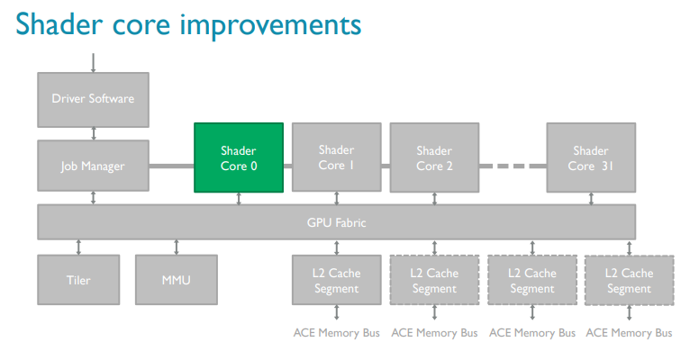 | 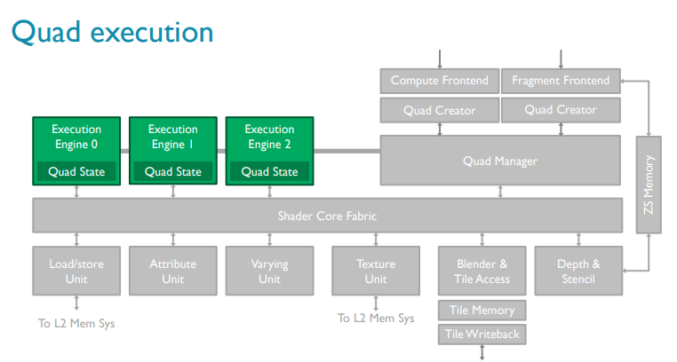 | 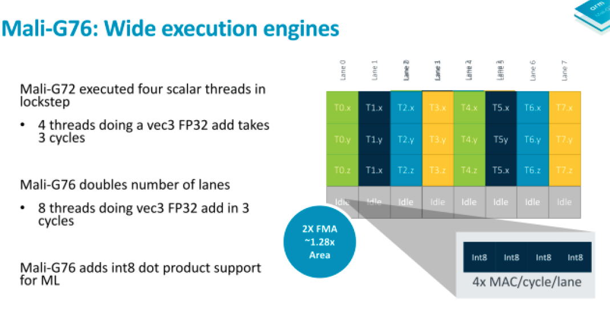 |

*From Arm's blog (italic fonts added later)*

Mali GPUs use an architecture in which instructions operate on multiple data elements simultaneously. The peak throughput depends on the hardware implementation of the Mali GPU type and configuration. Mali GPUs can contain many identical shader cores. *Each shader core supports hundreds of concurrently executing threads.*

Each shader core contains:

• One to three arithmetic pipelines or execution engines.

• One load-store pipeline.

• One texture pipeline.

*OpenCL typically only uses the arithmetic pipelines or execution engines and the load-store pipelines. The texture pipeline is only used for reading image data types. In the execution engines in Mali Bifrost GPUs, scalar instructions are executed in parallel so the GPU operates on multiple data elements simultaneously. You are not required to vectorize your code to do this.*

### G77 (Valhalla)

No longer "Quad engine". much wider. 

2x processing units per core

|                                  |                                |
| -------------------------------- | ------------------------------ |
| 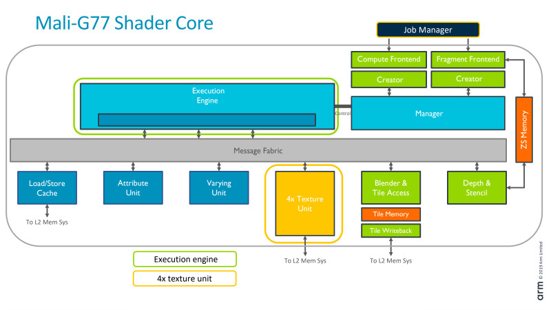 | 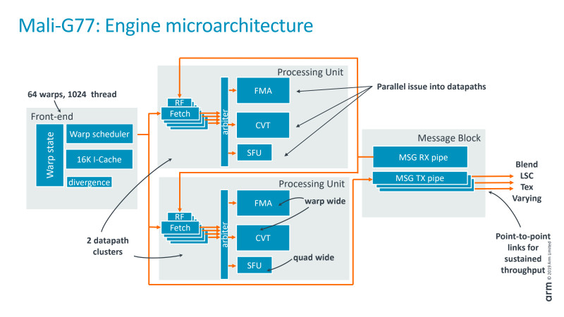 |


# Resources

## Projects 

PAtrace -- useful tools for Mali GLES record & replay
https://github.com/ARM-software/patrace

Panfrost
https://xdc2018.x.org/slides/Panfrost-XDC_2018.pdf

## Articles 

* good blog series. esp on Bifrost internals
https://community.arm.com/developer/tools-software/graphics/b/blog/posts/the-mali-gpu-an-abstract-machine-part-4---the-bifrost-shader-core

* The lima wiki provides lots of good info about Mali (may be outdated)
http://limadriver.org/T6xx+ISA/

Mali hardware (including 400)
https://limadriver.org/Hardware/

Lima driver arch (reverse enginerring, hw/sw interaction ... can be useful)
https://people.freedesktop.org/~libv/FOSDEM2012_lima.pdf

* T880 internals (good -- the GPU was used in mediatek x20)
https://www.hotchips.org/wp-content/uploads/hc_archives/hc27/HC27.25-Tuesday-Epub/HC27.25.50-GPU-Epub/HC27.25.531-Mali-T880-Bratt-ARM-2015_08_23.pdf

* G71, Bifrost. Good
https://www.hotchips.org/wp-content/uploads/hc_archives/hc28/HC28.22-Monday-Epub/HC28.22.10-GPU-HPC-Epub/HC28.22.110-Bifrost-JemDavies-ARM-v04-9.pdf

* “ARM Mali GPU Midgard Architecture”. Good slides on Midgard (2016. good)
http://fileadmin.cs.lth.se/cs/Education/EDAN35/guestLectures/ARM-Mali.pdf
https://www.hotchips.org/wp-content/uploads/hc_archives/hc28/HC28.22-Monday-Epub/HC28.22.10-GPU-HPC-Epub/HC28.22.110-Bifrost-JemDavies-ARM-v04-9.pdf

* Mali’s shader core: unified, for vertex/fragment/compute, varying 1--16. 
shared L2: 32--64KB
http://www.anandtech.com/show/8234/arms-mali-midgard-architecture-explored/7

* Midgard GPU arch (overview)
http://malideveloper.arm.com/downloads/ARM_Game_Developer_Days/PDFs/2-Mali-GPU-architecture-overview-and-tile-local-storage.pdf

* ARM mali officially supported boards (old?)
https://developer.arm.com/products/software/mali-drivers/user-space
inc.  T760MP4
http://en.t-firefly.com/en/firenow/firefly_rk3288/

* Linux’s support for Mali
https://wiki.debian.org/MaliGraphics

* Blogs on Mali driver internals (in Chinese, verbose. somewhat useful)
https://jizhuoran.gitbook.io/mali-gpu/mali-gpu-driver/she-bei-zhu-ce-gpu-register

# the kernel driver 

## Acronyms 

Kbdev -- kbase device. This corresponds to a GPU
Kctx -- a GPU context (?)
GP -- geometry processor
PP -- pixel processor
group -- A render group, i.e. all core sharing the same Mali MMU. see `struct mali_group`
kbase -- the kernel driver instance for midgard 
TLstream -- timeline stream (for trace record)
js - job slot. As exposed by GPUs
jc - job chain. 
Jd - job dispatcher (in the driver)
AS - address space (for GPU)
LPU -- Logical Processing Unit. For timeline display only (?)

## Overview

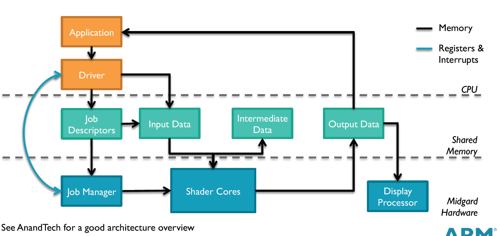

### Job chains

A job chain: a binary blob of GPU executable and its metadata. Wrapped in atom structure. Bet u/k,  "struct base_jd_atom_v2" is used, see `mali_base_kernel.h`. bet k/hw "struct kbase_jd_atom" is used, check this in "mali_kbase_defs.h".

kbase_jd_atom appears to be kernel's internal d/s. not shared with hw. Just to separate from the u/k interface (atom_v2), easy to change.

(base_jd_atom_v2.jc /* < job-chain GPU address */)

The former one passed by user and the latter is the driver's internal abstraction. Both have jc in their structure which points GPU kernel instructions I guess.

One can start from `kbase_api_job_submit()` in "mali_kbase_core_linux.c" which invoked when the job submitted by user space.

As both structure jc, the gpu instructions might be not different from each other. Both are baremetal. When compiling OCL kernel, we need to specify GPU model or the CL runtime checks the available GPU in the system.


## The register interface

### Overview

Primarily, there are 3 types of registers (CPU Control, Job Control, MMU Management).
GPU_CTRL: GPU Control
JOB_CTRL: JOB Control
MMU_MGMT: MMU Control

**Note** each type may have multiple instances. e.g. we may have a one GPU command register, 3 JS command registers, 8 AS command registers. 3 JS means you have three types of jobs e.g. shader, tiler, ... 8 AS are for multiple address spaces used by GPU, basically # of page tables the GPU can hold. Normally we only use a single page table since we do not generate multiple contexts.

Three types of commands can be written to their corresponding reg types: 
GPU_COMAMND: GPU-related (e.g. soft reset, performance counter sample, etc.)
JS_COMMAND: Job-related (e.g. start or stop processing a job chain, etc.)
AS_COMMAND: MMU-related (e.g. MMU lock, broadcast, etc.)

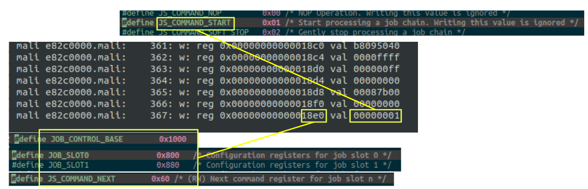

From Arm's [blog](https://community.arm.com/developer/tools-software/graphics/b/blog/posts/the-mali-gpu-an-abstract-machine-part-4---the-bifrost-shader-core) on command execution: 

> "The workload in each queue is broken into smaller pieces and dynamically distributed across all of the shader cores in the GPU, or in the case of tiling workloads to a fixed function tiling unit. Workloads from both queues can be processed by a shader core at the same time; for example, vertex processing and fragment processing for different render targets can be running in parallel" 

### Code
`Mali_kbas_device_hw_.c`

* kbase_reg_write()
* kbase_reg_read()

**Reg definition**: `Mali_kbase_gpu_regmap.h` 

### Reg map
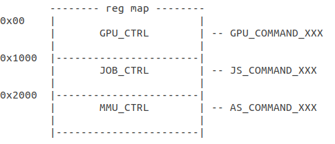

## Job slots

This is the CPU/GPU interface. 

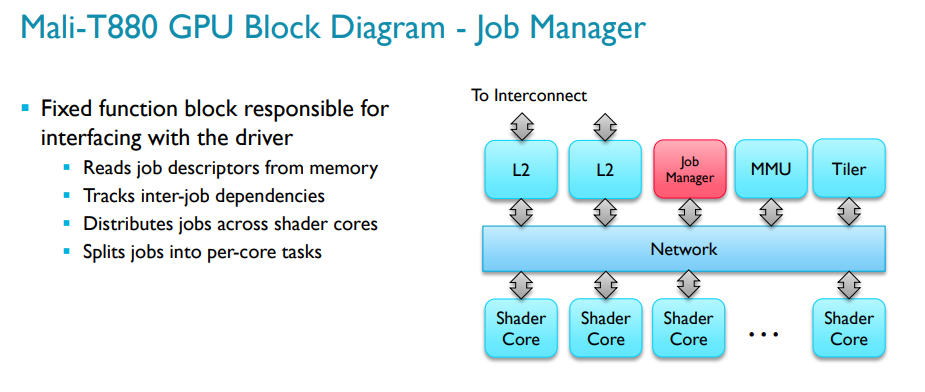

A job slot pertains to a job type. e.g. SLOT1 is for Tiling/Vertex/Compute. Slot 1 is default one.

Even the test application seems not to have any tiling/vertex, the atom comes from user runtime is not marked BASE_JD_REQ_ONLY_COMPUTE. 

Kernel code below: 
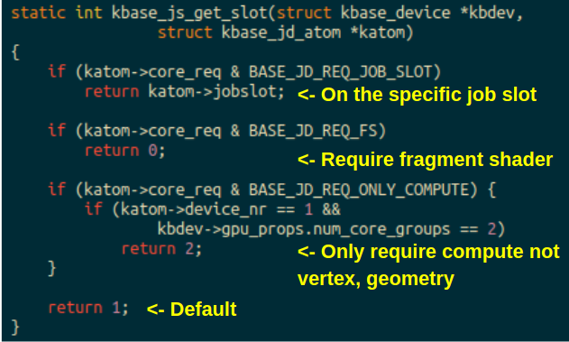


### The ringbuffer inside a job slot

GPU is aware of the "current" and "next" jobs. A ringbuffer (rb) seems managed by driver. The ringbuffer seems to track the "current" and "next" jobs on GPU. A ringbuffer can hold 2 jobs max. The driver puts jobs it intends to submit next, or already submitted, in the ringbuffer. 

Device driver manages jobs (atoms) by putting them into ring buffer (atoms and ring buffers managed by device driver).

Basically, device driver pulls runnable atom from queue and writes it to hardware job slot register, then kick GPU.

So ringbuffer is managed by device driver and a next atom to run is determined by device driver. It seems GPU only cares about atom written to job slots (check the next job slot and command, then do the things based on command).

The driver checks out atom state first and then put it into job_slot register.

**Code snippet ** 

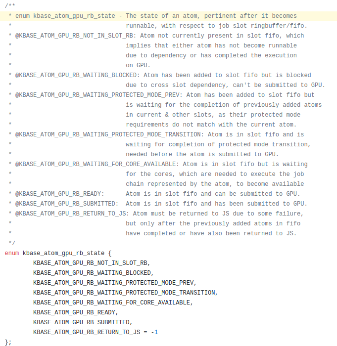

A ring buffer: two items. For current and next jobs. 

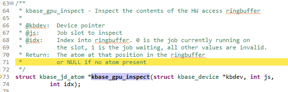

* regs for "next" job are R/W (==> the driver can modify them since the job is not kicked yet)

* regs for "current" job are R/O (==> the job is being executed on GPU. the driver cannot do anything about the job)

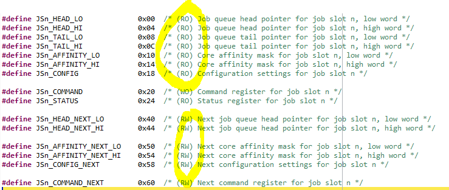

### Ringbuffer slot state

This is well commented


More evidence from the NoMali project (see `jobslot.hh`)


## Memory management  

#### Memory group manager

On hikey960, this is in mali_kbase_native_mgm.[c|h]
```
* kbase_native_mgm_dev - Native memory group manager device
 * An implementation of the memory group manager interface that is intended for
 * internal use when no platform-specific memory group manager is available.
 * It ignores the specified group ID and delegates to the kernel's physical
 * memory allocation and freeing functions.
```

Note this code is generic (drivers/base), not quite Mali specific. 
In odroid-xu4 v4.15, there's not such a component (??)
Absent in Hikey960 android kernel (4.19)

Seems the "root" of mm allocation. 

`memory_group_manager.h`
struct memory_group_manager_device - Device structure for a memory group
Since it is a "device structure"? Caan there be such hardware?
It defines a bunch of memory_group_manager_ops to be implemented… plat specific?
	
Kbdev->mgm_dev

#### Memory pool vs. memory group manager

One pool may contain pages from a specific memory group

Group id? 

A physical memory group ID. The meaning of this is defined by the systems integrator (???)

A memory group ID to be passed to a platform-specific memory group manager


* Pool -- a frontend of memory allocation
* Memory group manager -- the backend; platform specific. May or may not present (if not, just a sw impl?)

cf: drivers/memory_group_manager/XXX

"An example mem group manager" This seems a sw-only implementation. 

From kernel configuration: "This option enables an example implementation of a memory group manager for **allocation and release of pages for memory pools managed by Mali GPU device drivers.**"

**The example** instance will be init'd during "device probe time". Because it emulates a hw device (??)


There's also "physical mem group manager"? See the devicetree binding `memory_group_manager.txt`

 ## Tracing 

mali_kbase_tracepoints.[ch] useful. note they are auto-gen by some python code, missing in the kernel tree. 

There’s also debugfs support (MALI_MIDGARD_ENABLE_TRACE)

### Mali_kbase_tracepoints.c

*These seem all streamline events. Where do they go? via u/k buffer to Streamline?*

```
/* Message ids of trace events that are recorded in the timeline stream. */
enum tl_msg_id_obj {
	KBASE_TL_NEW_CTX,
	KBASE_TL_NEW_GPU,


#define OBJ_TL_LIST \
	TP_DESC(KBASE_TL_NEW_CTX, \
		"object ctx is created", \
		"@pII", \
		"ctx,ctx_nr,tgid") \
```

### Timeline stream abstraction

See very well documented

**mali_kbase_tlstream.h** 

Who will consume the stream? 

### Timeline infrastructure

**Mali_kbase_timeline.c**

**mali_kbase_timeline.h**

kbase_timeline_streams_flush(). To be invoked by user? It appears timeline shares a buffer with userspace? Flush to userspace? How is this done? 

**KBASE_AUX_PAGESALLOC**

Invoked upon phys page alloc/free…. Indicating changes of pages

### Streams

Two types of "streams". AUX and OBJ. Seems: _obj is for obj operation, like creating context, MMU. _aux is for other events, like PM, page alloc, etc. 

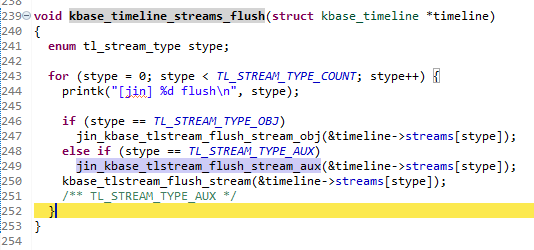

### Sample traces dumped from the driver

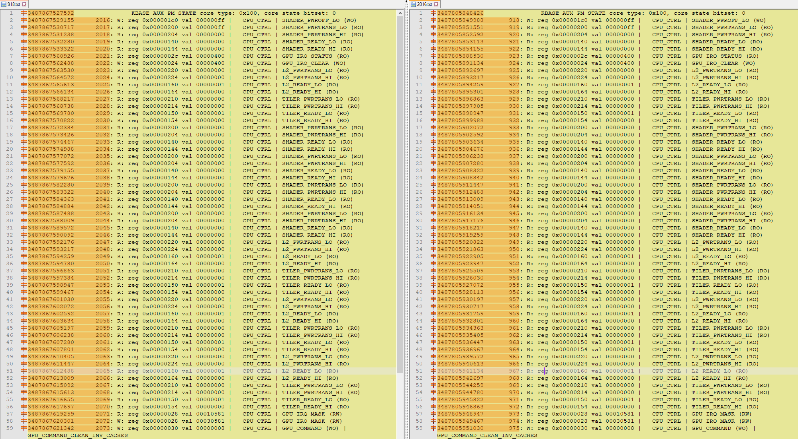

## GPU virtual memory

### Top level funcs: 
Mali_base_mmu.h // well written

### MMU
GPU MMU is programmed by CPU. 

Looks like a 4 level pgtable?? (this is for Bifrost.. They didn’t change the macro names)
	#define MIDGARD_MMU_TOPLEVEL    MIDGARD_MMU_LEVEL(0)
	#define MIDGARD_MMU_BOTTOMLEVEL MIDGARD_MMU_LEVEL(3)
See kbase_mmu_teardown_pages()

For Midgard, 2 levels. 

Update hw mmu entries??

kbase_mmu_hw_configure, called by mmu_update(), by kbase_mmu_update


#### Reg defs
see `mali_kbase_gpu_regmap.h`Max 16 addr spaces

#### d/s

struct kbase_mmu_table  - object representing a set of GPU page tables. @pgd -- pgtable root (hw address)

struct kbase_mmu_mode - object containing pointer to methods invoked for programming the MMU, as per the MMU mode supported by Hw.

struct kbase_as - object representing an address space of GPU.

One kbase_device has many (up to 16) kbase_as `struct kbase_as as[BASE_MAX_NR_AS]`;
	
Each @kbase_context has a @as_nr, which seems to point to the as. 

#### Code
drivers\gpu\arm\midgard\mmu

High level MMU function
kbase_mmu_flush_invalidate_noretain()

(..goes into…)
The actual hw function operating MMU:
Mali_kbase_mmu_hw_direct.c  --> kbase_mmu_hw_do_operation(), etc.

#### Pgtable 
Allocate page table for GPU
kbase_mmu_alloc_pgd()

#### Kernel threads
Workqueue mali_mmu
page_fault_worker
bus_fault_worker

#### Address space
This is like "segment". One addr space seems a tree of pgtables. 
The  actual count of addr spaces…. Supported by MMU hardware
```
 * @nr_hw_address_spaces:  Number of address spaces actually available in the
                          GPU, remains constant after driver initialisation.
 * @nr_user_address_spaces: Number of address spaces available to user contexts
```
// 8 for G71

See
kbase_device_as_init()

```
// desc for one addr space… 
struct kbase_mmu_setup {
	u64	transtab; // translation table? See AS_TRANSTAB_BASE_MASK
	u64	memattr;
	u64	transcfg; // translation cfg? See AS_TRANSCFG_ADRMODE_AARCH64_4K etc.
};
```

Configuration 
kbase_mmu_get_as_setup()

#### Mmap path 
Right, at that time that only allocate page for GPU pgtable only. 

Think mapping happen when mmap() is called, which invokes kbase_mmap() and t thus kbase_context_mmap().
There is a structure called "kbase_va_region" which contains some mapping related information.

Basically, pages are allocated in GPU side and then CPU calls kbase_mmap to get the allocated pages from GPU side.
Look at kbase_reg_mmap() and kbase_gpu_mmap(). It tries to let GPU use same VA of CPU and maps the VA to PA updating MMU.


